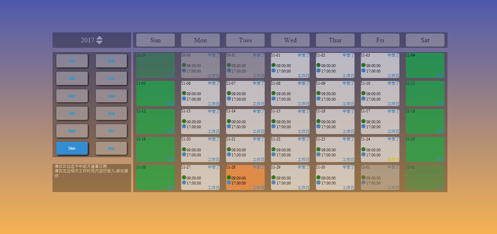
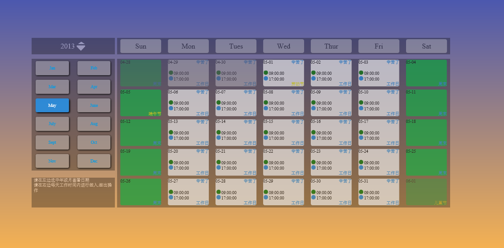

## calendar
a calendar made by html5 ,css3 and es6.
### usage
1. 直接查看作品请进入app文件夹下，用浏览器打开index.html文件
2. 查看源码请到src目录下，使用或者编译源码请按3，4步骤
3. Run `npm install` in the commend line to install the modules.
4. Run `npm run dev` to begin the webpack server and then you can code and view the result.

### usage
1. 初始页面

2. 切换年月

